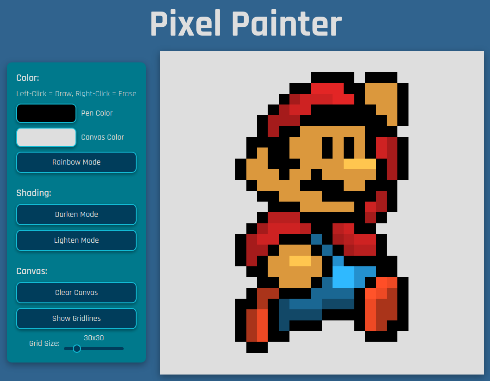

# Pixel Painter

<!-- PROJECT LOGO -->
 

  

<h3 align="center">Pixel Painter</h3>

  

    A web-based paint application.
     
    <a href="https://djsereno.github.io/Pixel-Painter/">Preview</a>
    ·
    <a href="https://github.com/djsereno/Pixel-Painter/issues">Report Bug</a>
    ·
    <a href="https://github.com/djsereno/Pixel-Painter/issues">Request Feature</a>
  

## Built With

- Javascript
- HTML/CSS

## Usage

Left-click to paint, right-click to erase. Rainbow mode will change the pen color on every mouse click. Use darken or lighten mode to shade existing pixels. Note: resizing the grid will also wipe the canvas.

## Contact

Derek Sereno - [LinkedIn](https://www.linkedin.com/in/dereksereno/) - [Email](mailto:djsereno91@gmail.com)

Project Link: [https://github.com/djsereno/Pixel-Painter/](https://github.com/djsereno/Pixel-Painter/)

## Acknowledgments

- Favicon courtesy of [icons8](https://icons8.com/)
